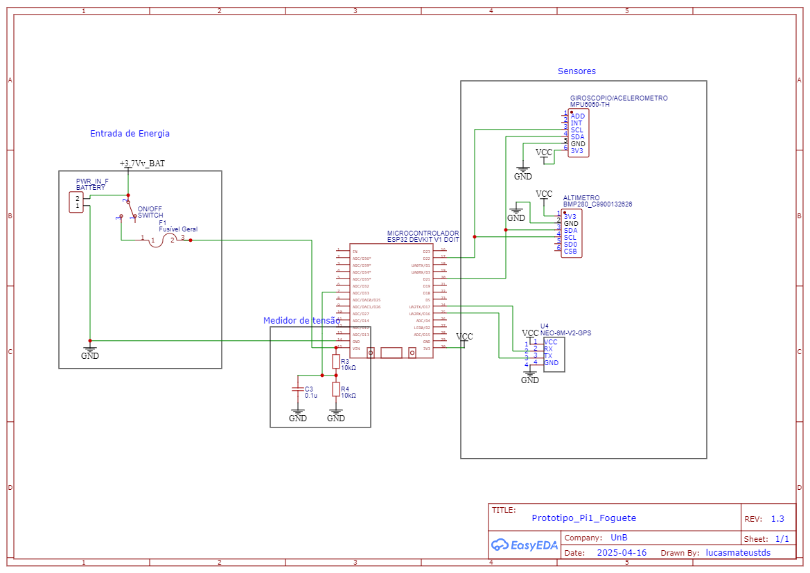

---

# 🚀 Telemetria para Foguete d'Água - Projeto Integrador 1

## 📌 Visão Geral do Projeto

Este repositório contém o sistema de telemetria desenvolvido para um foguete d'água como parte do Projeto Integrador 1 da faculdade. O objetivo principal é criar um sistema confiável para monitorar dados de voo em tempo real, possibilitando análise posterior e aprimoramento do desempenho do foguete.

## 🎯 Objetivos do Projeto

* Implementar um sistema de telemetria eficiente
* Coletar e transmitir os seguintes dados:

  * Altitude
  * Aceleração (X, Y, Z)
  * Orientação (pitch e roll)
  * Posição (Lat, Log)
  * Temperatura ambiente
* Armazenar os dados em cartão SD
* Disponibilizar visualização em tempo real e análise posterior

## 🛰️ Componentes do Sistema de Telemetria

### Hardware

* **Microcontrolador**: ESP32
* **Sensores**:
  * GY-NEO6MV2 (GPS)
  * MPU6050 (Acelerômetro + Giroscópio)
  * BMP280 (Altímetro + Temperatura)
* **Comunicação**: ESP-NOW / WiFi
* **Armazenamento**: Cartão SD

### Software

* Código em **C++** com PlatformIO
* Lógica modular para sensores, comunicação e registro
* Visualização de dados com ferramentas externas (ex.: Excel, Python)

## 📂 Estrutura do Repositório

```
projeto-foguete-telemetria/
│
├── include/               # Arquivos de cabeçalho
│   ├── SensorStructs.h    # Definições de structs para sensores
│   └── Config.h           # Parâmetros de configuração
│
├── src/                   # Código-fonte principal
│   ├── main.cpp           # Loop principal
│   ├── sensors.cpp        # Leitura dos sensores
│   └── communication.cpp  # Transmissão de dados
│
├── docs/                  # Arquivos de documentação
│
├── resources/             # Imagens, esquemas e diagramas
│
├── test/                  # Testes unitários e funcionais
│
└── README.md              # Este arquivo
```

## 🔧 Tecnologias Utilizadas

* **Linguagem**: C++
* **Plataforma**: PlatformIO + Arduino Framework
* **Microcontrolador**: ESP32
* **Sensores**: MPU6050, BMP280
* **Transmissão**: ESP-NOW / WiFi
* **Armazenamento**: SD Card (CSV)

<div style="text-align: center;">
    
</div>

## 🚀 Funcionalidades Principais

1. **Aquisição de Dados**

   * Aceleração e orientação em tempo real
   * Medição de altitude e temperatura ambiente

2. **Transmissão Sem Fio**

   * Comunicação ESP-NOW de baixa latência
   * Alcance de até 1 km em campo aberto

3. **Armazenamento Local**

   * Registro em cartão SD
   * Dados salvos em CSV com timestamp

## 📊 Métricas e Precisão

* **Precisão de altitude**: ±0.5 m (BMP280)
* **Amostragem**: 10 Hz
* **Precisão de aceleração**: ±0.1 m/s²
* **Temperatura operacional**: -10°C a 85°C

## 🔬 Desafios Enfrentados

* Calibração precisa dos sensores em ambiente dinâmico
* Minimização de perda de pacotes na transmissão
* Proteção contra interferências e vibração excessiva

## 🛠️ Configuração e Instalação

### Requisitos

* PlatformIO instalado
* Placa ESP32 adicionada
* Bibliotecas:

  * `Adafruit_BMP280`
  * `MPU6050`
  * `SD`
  * `ESP-NOW`

### Instalação

1. Clone este repositório
2. Abra com PlatformIO (VS Code)
3. Instale as dependências
4. Compile e envie o firmware para o ESP32

## 🤝 Como Contribuir

1. Fork este repositório
2. Crie uma nova branch com sua feature
3. Faça commit das mudanças
4. Envie um push para a branch
5. Abra um Pull Request

## 📋 Documentação Complementar

* [Documentação do Projeto](https://twchronous.github.io/Projeto-Integrador-1/md_readme.html)

## 📄 Licença

Este projeto está licenciado sob a [CC0](./LICENSE).

---
