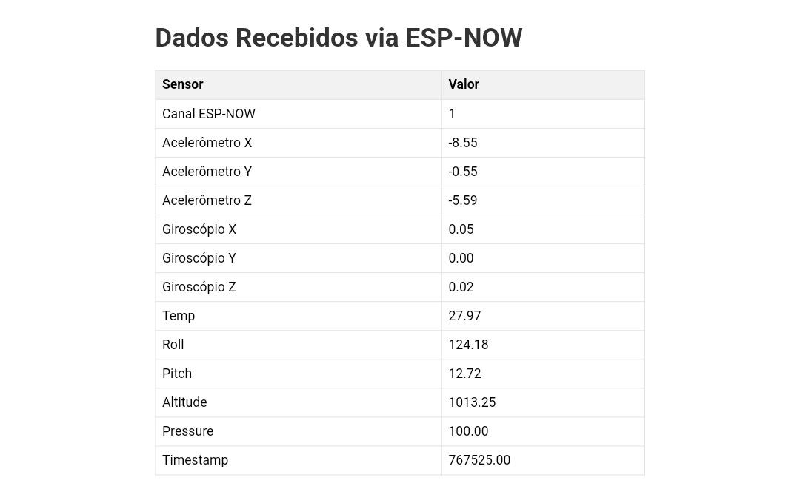

# 🚀 Telemetria para Foguete d'Água - Projeto Integrador 1

## 📌 Visão Geral

Este repositório contém o sistema de telemetria desenvolvido para um foguete d'água como parte do Projeto Integrador 1 da faculdade. O objetivo principal é criar um sistema robusto de monitoramento em tempo real para coletar, transmitir e registrar dados durante o voo do foguete.

---

## 🎯 Objetivos

* Desenvolver um sistema de telemetria confiável e preciso
* Coletar dados de:
  * Altitude
  * Aceleração
  * Orientação (pitch e roll)
  * Temperatura
* Transmitir os dados em tempo real via comunicação sem fio
* Registrar as informações para análise pós-voo

---

## 🛰️ Componentes do Sistema

### 🧩 Hardware

* **Microcontrolador:** ESP32
* **Sensores:**

  * MPU6050 (Acelerômetro/Giroscópio)
  * BMP280 (Altímetro e Temperatura)
* **Comunicação:** ESP-NOW / Wi-Fi

### 💾 Software

* Firmware em **C++** com **PlatformIO** e **framework Arduino**
* Módulo de comunicação sem fio
* Sistema de registro em cartão SD
* Interface Web para visualização dos dados

---

## 📁 Estrutura do Projeto

```
projeto-foguete-telemetria/
│
├── include/               # Arquivos de cabeçalho
│   ├── SensorStructs.h    # Estruturas dos dados dos sensores
│   └── Config.h           # Definições e parâmetros do sistema
│
├── src/                   # Código-fonte
│   ├── main.cpp           # Lógica principal
│   ├── sensors.cpp        # Leitura e processamento dos sensores
│   └── communication.cpp  # Envio e recepção de dados via ESP-NOW
│
├── docs/                  # Documentação adicional
├── resources/             # Imagens, esquemas e recursos visuais
├── test/                  # Testes unitários e de integração
└── README.md              # Este arquivo
```

---

## 🔧 Tecnologias Utilizadas

* **Linguagem:** C++
* **Plataforma:** PlatformIO + Arduino
* **Microcontrolador:** ESP32
* **Comunicação:** ESP-NOW e Wi-Fi
* **Sensores:** MPU6050, BMP280

---

## 🚀 Funcionalidades

### 📡 Coleta de Dados

* Temperatura
* Altitude em tempo real
* Cálculo de roll e pitch
* Aceleração nos eixos X, Y e Z
* Giroscópio (gyroX, gyroY, gyroZ)


---

## 📊 Métricas de Precisão

| Parâmetro            | Precisão     |
| -------------------- | ------------ |
| Altitude             | ±0.5 metros  |
| Aceleração           | ±0.1 m/s²    |
| Temperatura          | -10°C a 85°C |
| Frequência de coleta | 10 Hz        |

---

## 🔬 Desafios Técnicos

* Manter leitura estável em ambientes com vibração intensa
* Confiabilidade da comunicação sem fio em campo aberto
* Garantir sincronização e integridade dos dados dos sensores

---

## 🛠️ Instalação e Configuração

### ⚙️ Requisitos

* PlatformIO instalado (VSCode recomendado)
* Placa ESP32
* Bibliotecas:

  * `Adafruit BMP280`
  * `Wire`
  * `Adafruit MPU6050` (ou similar)
  * `ESP-NOW`

### 📦 Passos

1. Clone este repositório:

   ```bash
   git clone https://github.com/twChronous/Projeto-Integrador-1.git
   ```
2. Abra o projeto no **PlatformIO**
3. Conecte seu ESP32 via USB
4. Compile e envie o firmware com:

   ```bash
   pio run --target upload
   ```

---

## 📡 Formato de Dados Transmitidos

### Rota `/json`

```json
{
  "sensors": {
    "altimetro": {
      "altitude": 0.0,
      "pressure": 0.0
    },
    "acelerometro": {
      "accX": 0.0,
      "accY": 0.0,
      "accZ": 0.0,
      "gyroX": 0.0,
      "gyroY": 0,
      "gyroZ": 0.0,
      "temp": 0.0,
      "roll": 0.0,
      "pitch": 0.0
    },
    "tensao": {
      "voltage_base": 0,
      "voltage_rocket": 0
    },
    "gps": {
      "latitude": 0.0,
      "longitude": 0.0,
      "altitude": 0.0,
      "day": 01,
      "month": 12,
      "year": 2000,
      "hour": 00,
      "minute": 00,
      "second": 00
    },
    "esp_now_channel": 1,
    "mac_address": "FF:FF:FF:FF:FF",
    "timestamp": 0
  }
}
```

### Rota `/` (Interface Web)

Exibe uma página HTML com os dados recebidos formatados em uma tabela e atualizados automaticamente a cada 2 segundos.

---

## 🧪 Exemplo de Interface web

<div align="center">
    
</div>

## 🧪 Esquema eletrico

<div align="center">
    
</div>

---

## 🤝 Contribuições

Contribuições são bem-vindas! Para colaborar:

1. Faça um fork do projeto
2. Crie uma branch para sua feature
3. Commit suas mudanças
4. Push na sua branch
5. Crie um Pull Request

---

## 📚 Documentação

* [Página da documentação](https://twchronous.github.io/Projeto-Integrador-1/md_readme.html)

---

## 📄 Licença

Distribuído sob a licença [CC0](./LICENSE).

